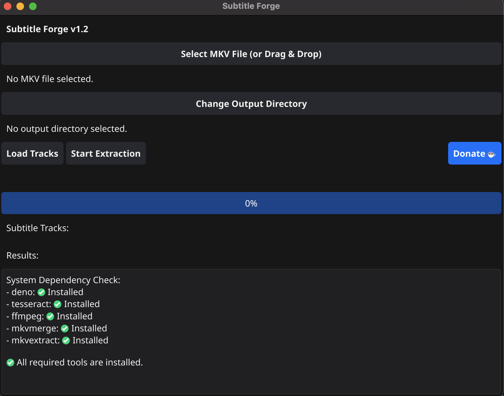

# Subtitle Forge v1.1

A powerful GUI application for extracting and converting subtitles from MKV files, with specialized support for transforming PGS subtitles to SRT format.

*Subtitle Forge in action*

## Features

- User-friendly graphical interface
- Extract subtitle tracks from MKV files
- Convert PGS/SUP subtitles to SRT format using OCR
- Enhanced progress reporting:
  - Detailed progress bar showing percentage complete
  - Real-time frame processing status
  - Elapsed time tracking
  - Estimated time remaining calculation
- Detailed logging for troubleshooting
- Cross-platform support (macOS, Windows, Linux)
- Automatic dependency checking at startup
- Drag-and-drop support for MKV files
- Automatic output directory setting (defaults to MKV file location)
- Support button for donations
- Proper file permissions for extracted subtitle files

## What's New in v1.1

- Enhanced user interface with improved layout and responsiveness
- Added real-time progress tracking for PGS to SRT conversion
- Improved error handling and user feedback
- Fixed issues with subtitle track detection in certain MKV files
- Added support for drag-and-drop functionality
- Optimized conversion process for better performance
- Various bug fixes and stability improvements

## Requirements

- [Deno](https://deno.land/) (for running the PGS to SRT conversion script)
- [mkvmerge](https://mkvtoolnix.download/) (part of MKVToolNix)

## Installation

### macOS

1. Extract the `subtitle-forge-macos.tar.gz` archive
2. Install Deno: `brew install deno`
3. Install MKVToolNix: `brew install mkvtoolnix`
4. Run the application: `./subtitle-forge-mac`

#### Handling Security Warnings

When running the application for the first time, macOS may display a security warning: "Apple can't verify that this app is free from malware." This happens because the application isn't signed with an Apple Developer certificate. To bypass this:

**Method 1: Using Finder**
1. Locate the application in Finder
2. Right-click (or Control-click) on the application
3. Select "Open" from the context menu
4. Click "Open" in the dialog that appears
5. After doing this once, you can open the application normally in the future

**Method 2: Using Terminal**
1. Open Terminal
2. Run: `xattr -d com.apple.quarantine /path/to/subtitle-forge-mac`
3. Replace `/path/to/` with the actual path to the application

**Note:** This warning appears because the application is not signed with an Apple Developer certificate, not because it contains malware.

### Windows

1. Extract the `subtitle-forge-windows.zip` archive
2. Install Deno: [Deno Installation](https://deno.land/#installation)
3. Install MKVToolNix: [MKVToolNix Download](https://mkvtoolnix.download/downloads.html)
4. Add both to your PATH environment variable
5. Run the application by double-clicking `subtitle-forge.exe`

### Linux

1. Extract the `subtitle-forge-linux.tar.gz` archive
2. Install Deno: `curl -fsSL https://deno.land/x/install/install.sh | sh`
3. Install MKVToolNix: Use your distribution's package manager (e.g., `apt install mkvtoolnix`)
4. Run the application: `./subtitle-forge-linux`

## Usage

1. Load an MKV file using one of these methods:
   - Click "Select MKV File" to choose your MKV file using the file dialog
   - Or simply drag and drop an MKV file onto the application window
2. The output directory is automatically set to the same location as your MKV file
   - You can change it by clicking "Change Output Directory" if needed
3. Click "Load Tracks" to see available subtitle tracks
4. Select the subtitle tracks you want to extract/convert
5. Click "Start Extract" to begin the process
6. Monitor the progress in the application window

## Building from Source

### Prerequisites

- Go 1.18 or later
- Fyne dependencies: [Fyne Getting Started](https://developer.fyne.io/started/)

### Build Steps

1. Clone the repository
2. Navigate to the `fyne-gui` directory
3. Run the build script: `./build.sh`

For cross-compilation, you may need additional tools:
- For Windows builds on macOS: `brew install mingw-w64`
- For Linux builds on macOS: `brew install FiloSottile/musl-cross/musl-cross`

## Troubleshooting

- The application automatically checks for required dependencies at startup
- Missing dependencies will be clearly indicated in the application window
- Ensure Deno and mkvmerge are in your PATH
- Check the conversion logs in the output directory
- For permission issues, try running the application with administrator privileges

## PGS to SRT Conversion Process

The application includes a powerful feature to convert PGS/SUP subtitle files (image-based subtitles) to SRT format (text-based subtitles) using Optical Character Recognition (OCR). This process involves several steps:

### How It Works

1. **Extraction**: First, the PGS subtitles are extracted from the MKV file using `mkvextract` as .sup files

2. **OCR Processing**: The extracted .sup files are then processed using a Deno-based script that:
   - Decodes the PGS/SUP format to extract individual subtitle frames
   - Uses Tesseract OCR to convert the subtitle images to text
   - Preserves timing information from the original subtitles
   - Formats the output as a standard SRT file

3. **Real-time Feedback**: During conversion, the application provides:
   - Progress updates
   - Elapsed time tracking
   - Detailed logs of the conversion process

### Requirements for OCR

- **Deno Runtime**: Required to execute the conversion script
- **Tesseract OCR**: The underlying OCR engine used for text recognition
- **Tessdata Files**: Language training data for Tesseract (English data included by default)

### Performance Considerations

- OCR conversion is CPU-intensive and may take significant time for longer subtitle tracks
- The quality of the OCR results depends on several factors:
  - Resolution and clarity of the original PGS subtitles
  - Font style used in the original subtitles
  - Language of the subtitles (English works best with the default configuration)

### Troubleshooting OCR Conversion

- If conversion fails, check that Deno is properly installed and in your PATH
- Verify that the Tesseract language data files are available
- For poor OCR quality, you may need to adjust the conversion parameters in the script
- The application creates detailed logs that can help diagnose conversion issues

## License

[MIT License](LICENSE)
